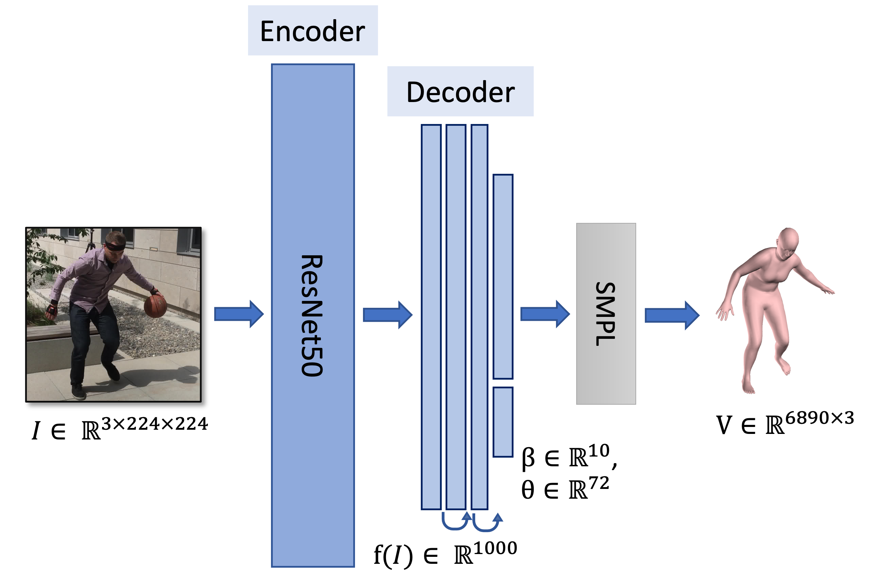
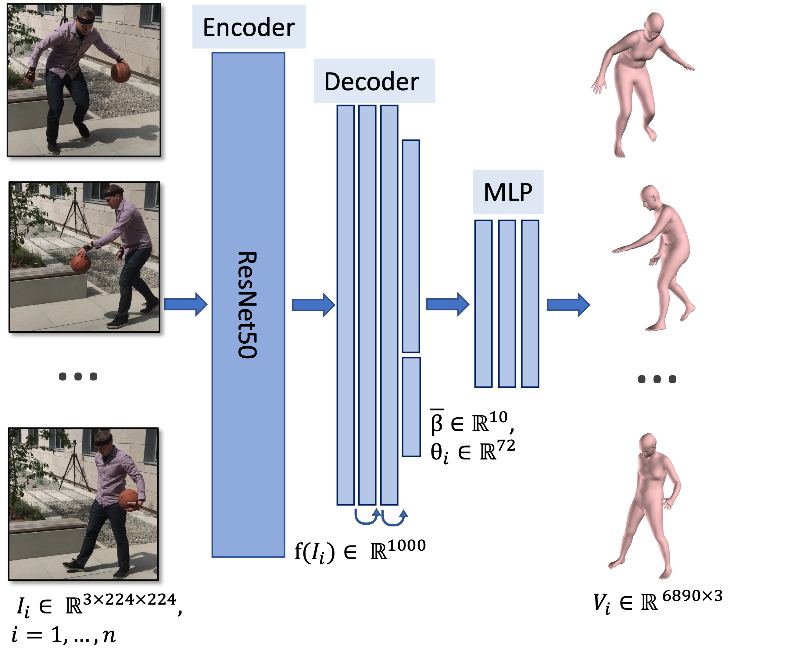
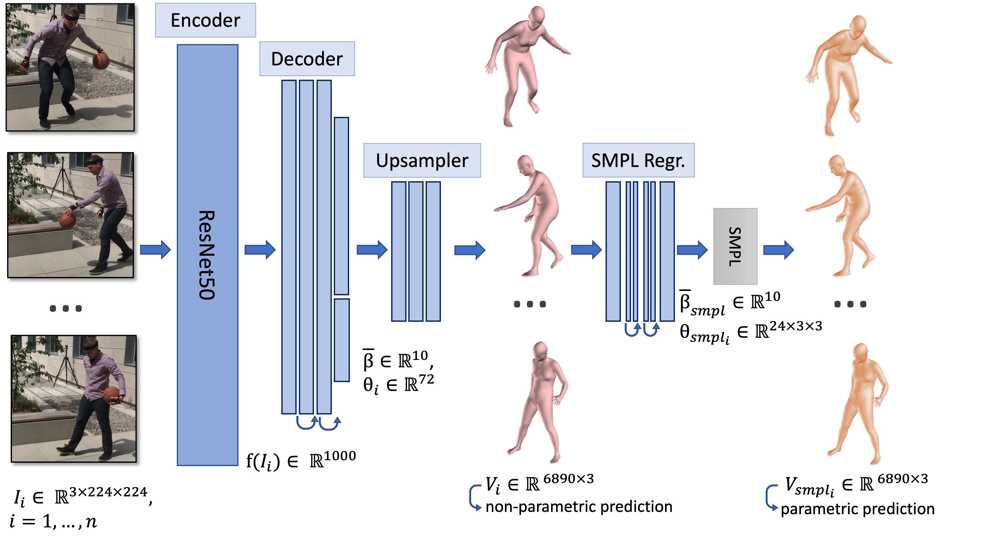

# BA-HMR

Code-base of my Bachelor Thesis Project of "Predicting 3D-Human Meshes from RGB images - a parametric and non parametric approach". 
Supervisor: Prof. Andreas Schilling, University of Tübingen, Visual Computation


### Requirements 
- Python 3.9.5
- Pytorch 1.9.0
- Torchvision 0.10.0
### Installation (using conda)
2. Install Pytorch and Torchvision 
```console
$ conda install pytorch torchvision torchaudio -c pytorch
```
3. Install Requirements
```console
$ pip install -r requirements.txt
```

## Start Training:
### Model 1: Parametric Model

```console
$ python start_train_fulldata_param.py --cfg ./configs/experiments/seq_zarr_resnet34_ep50.yaml
```
### Model 2.1: Non-Parametric Model


```console
$ python start_train_seq_fulldata_non_param.py --cfg ./configs/experiments/seq_zarr_resnet34_ep50.yaml
```


### Model 2.1: Non-Parametric Model, extended


```console
$ python start_train_seq_fulldata_non_param_ext.py --cfg ./configs/experiments/seq_zarr_resnet34_ep50.yaml
